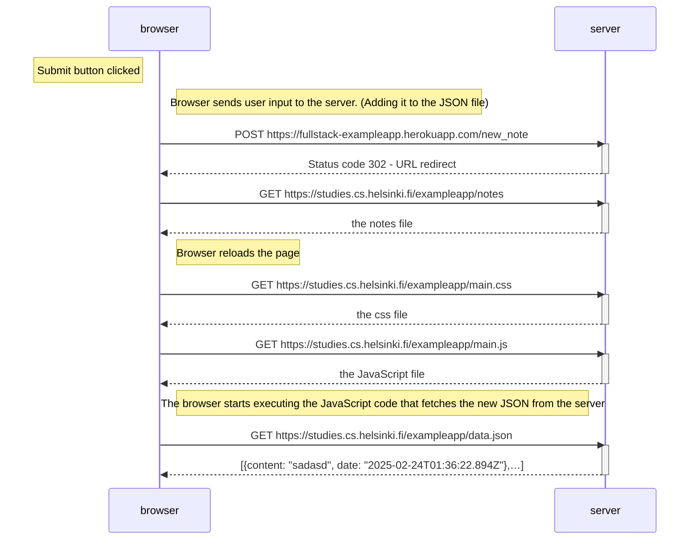

```mermaid
sequenceDiagram
    participant browser
    participant server

    Note left of browser: Submit button clicked
    Note right of browser: Browser sends user input to the server. (Adding it to the JSON file)
    browser->>server: POST https://fullstack-exampleapp.herokuapp.com/new_note
    activate server
    server-->>browser: Status code 302 - URL redirect
    deactivate server
    
    browser->>server: GET https://studies.cs.helsinki.fi/exampleapp/notes
    activate server
    server-->>browser: the notes file
    deactivate server
    Note right of browser: Browser reloads the page


    browser->>server: GET https://studies.cs.helsinki.fi/exampleapp/main.css
    activate server
    server-->>browser: the css file
    deactivate server

    browser->>server: GET https://studies.cs.helsinki.fi/exampleapp/main.js
    activate server
    server-->>browser: the JavaScript file
    deactivate server
    Note right of browser: The browser starts executing the JavaScript code that fetches the new JSON from the server

    browser->>server: GET https://studies.cs.helsinki.fi/exampleapp/data.json
    activate server
    server-->>browser: [{content: "sadasd", date: "2025-02-24T01:36:22.894Z"},…]
    deactivate server
```
