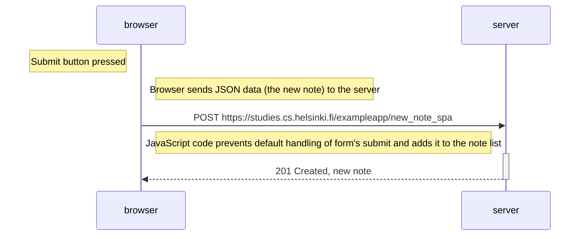

```mermaid
sequenceDiagram
    participant browser
    participant server

    Note left of browser: Submit button pressed

    Note right of browser: Browser sends JSON data (the new note) to the server
    browser->>server: POST https://studies.cs.helsinki.fi/exampleapp/new_note_spa
    Note left of server: JavaScript code prevents default handling of form's submit and adds it to the note list
    activate server
    server-->>browser: 201 Created, new note
    deactivate server
```
